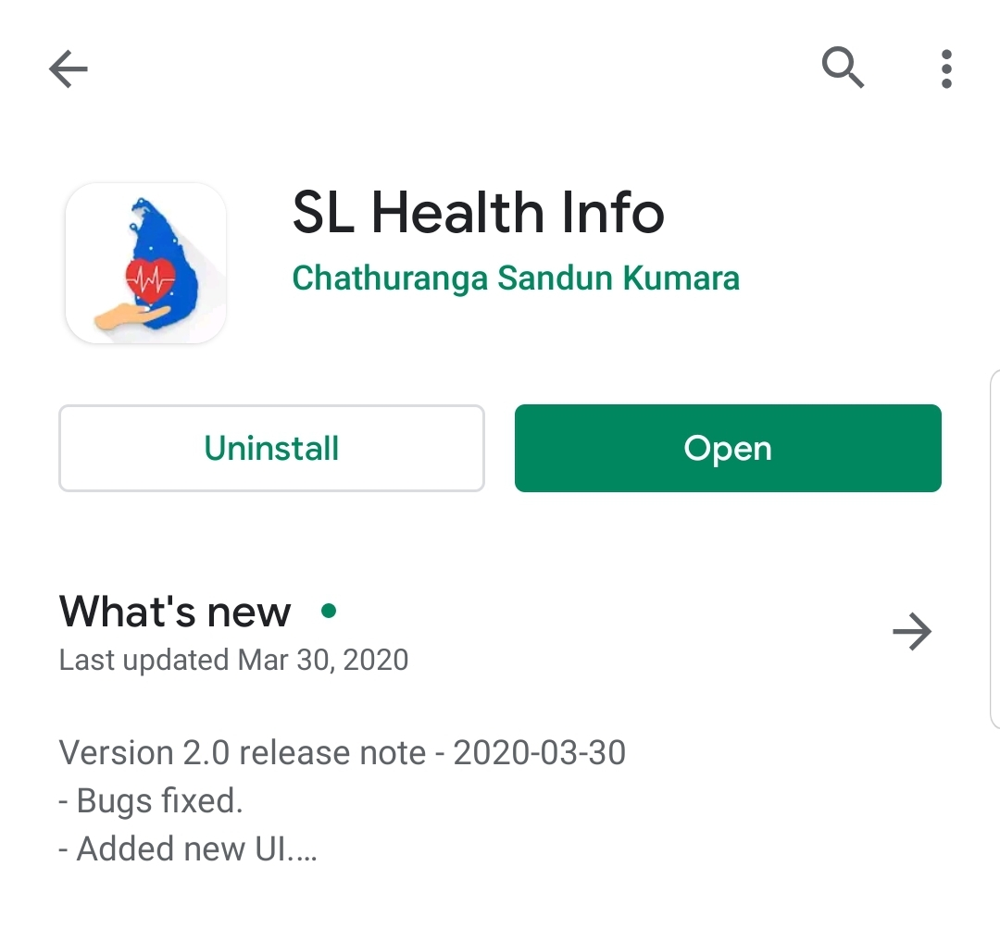
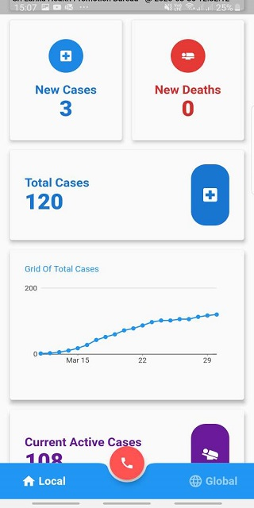
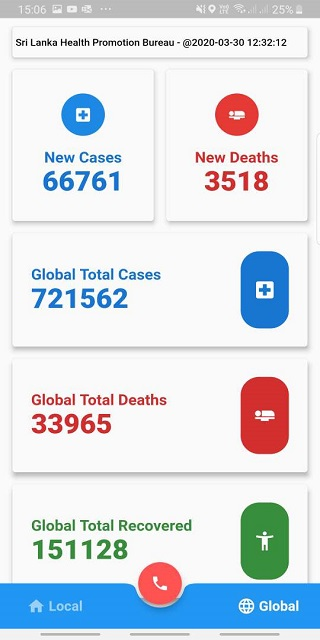
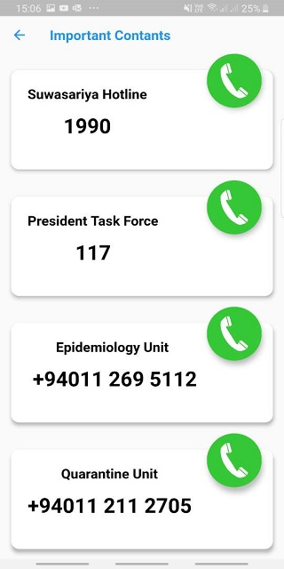

# SL HEALTH INFO

Introduced a live updated dashboard with Covid-19 Srilanka statistic and world situation. It informs you updates via a notification.

Prowered from [Health Pramote Bureau. covid updates API (https://hpb.health.gov.lk/en/api-documentation)](https://hpb.health.gov.lk/en/api-documentation)

## Google Playstore Link

## Technologies
1. Flutter
2. Firebase Cloud push notification
3. Google Playstore
4. Rest Api - https://hpb.health.gov.lk/en/api-documentation
5. [own Api](https://github.com/ChathurangaSandun/SL_Health_Info-API) - to calculate differences and push notification to firebase
6. cron joibs
7. sql server database
8. azure web hosting 

These are the main screens

          

